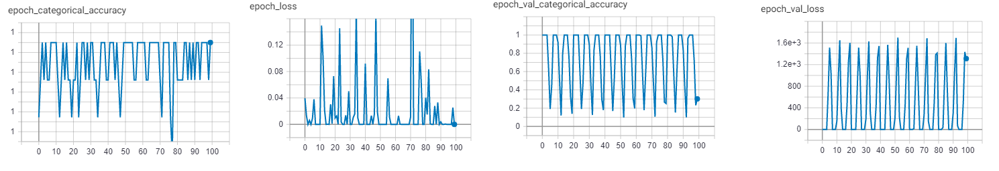
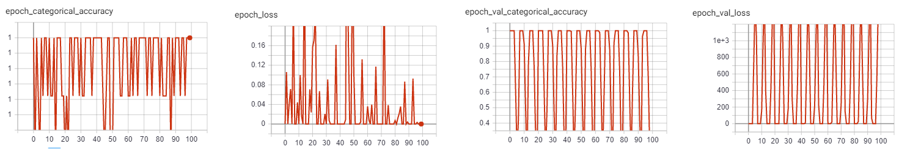
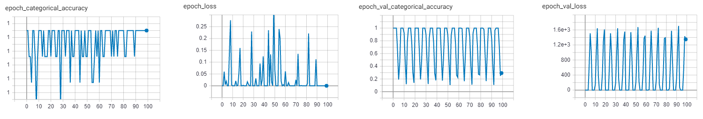

# Lab 3  

темп обучения (lr)
# 2b 
Cеть с lr=0.001 на обучающей выборке сходится быстрее всех.

* lr=0.001

* lr=0.005 

* lr=0.01 

# 3c
Cеть с lr=0.001 на обучающей выборке сходится быстрее всех.

* lr=0.001

* lr=0.005 

* lr=0.01 

# 3d
* lr=0.001

* lr=0.005

* lr=0.01

# 3e
* lr=0.001

* lr=0.005

* lr=0.01

