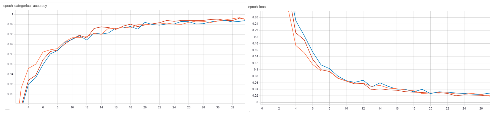

# Lab 4
### lr - темп оюучения
#### Выбор  максимально возможного темпа обучения
* Оранжевый - lr=0.1
* Синий - lr=0.01
* Красный - lr=0.001
* Голубой -  lr=0.0001
* Голубой -  lr=0.0001
* Розовый -  lr=0.00001

Так как при lr=0.00001 принимает наименьшее значение из всех значений функций потерь, то это значение выбрано как  максимально возможный темп обучения
##  Горизонтальное отражение

## Поворот на случайный угол
* Розовый 30
* Бирюзовый 45
* Серый 60

### Сравнение

## Изменение яркости и контраста
 * Оранжевый   
- [x] tf.image.random_brightness(image, 0.5, seed=None)
- [x] tf.image.random_contrast(image, lower=0.2, upper=1.2 seed=None)
* Синий 
- [x] tf.image.random_brightness(image, 0.4, seed=None)
- [x] tf.image.random_contrast(image, lower=0.1, upper=1.1 seed=None)
* Красный 
- [x] tf.image.random_brightness(image, 0.6, seed=None)
- [x] tf.image.random_contrast(image, lower=0.3, upper=1.3 seed=None)

### Сравнение

## Использование случайного участка изображения
* Синий - размер участка  120 х 120
* Красный - размер участка  180 х 180
* Голубой - размер участка  60 х 60

### Сравнение

Поведение валидационных графиков можно охарактеризовать как отсутствием большого количества входных данных.
